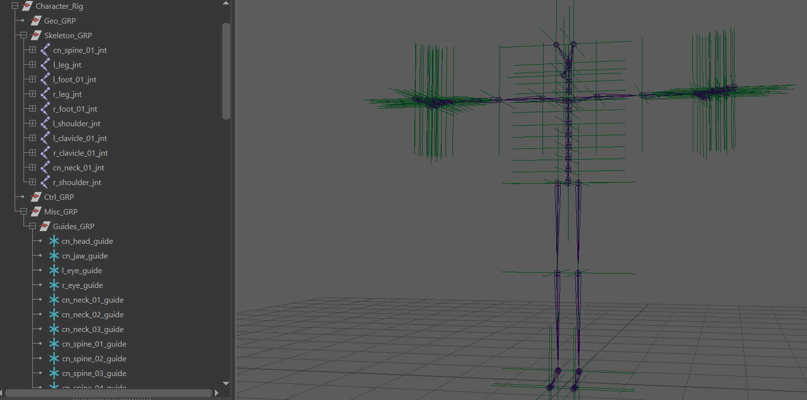

  

# RigUp
A Maya-based biped auto-rigging tool designed to assist with character rig creation and setup.

# Software Used
Autodesk Maya 2025 • Python • PySide6 • Qt Designer • Adobe Photoshop

# Goals
The goal of this project is to create a modular biped auto-rigging tool for Autodesk Maya that is designed to assist with character rig creation. It automates repetitive rigging tasks while generating organized, animator-friendly control systems that can be adapted to a variety of humanoid characters.

# Planned Features:
• Guide Creation ✓

• Skeleton Hierarchy ✓

• Joint Orientation ✓

• Rig Hierarchy ✓

• Control Generation

• Offset Groups

• FK Systems

• IK Systems

• IK/FK Blending

• Foot System

• Stretch & Squash

• Clavicle Controls

• Pelvis Controls

• COG Control

• Global/Master Controls

• IK/FK Matching

• Attribute Management

• Skinning & Deformation Setup

• User Interface

• Rig Stress Testing

# Automated Rig Hierarchy — RigUp Development

  

# Documentation
Documentation includes

• Installation Guide

• How to Use

• Planned Updates

© 2026 Melodi Clark
